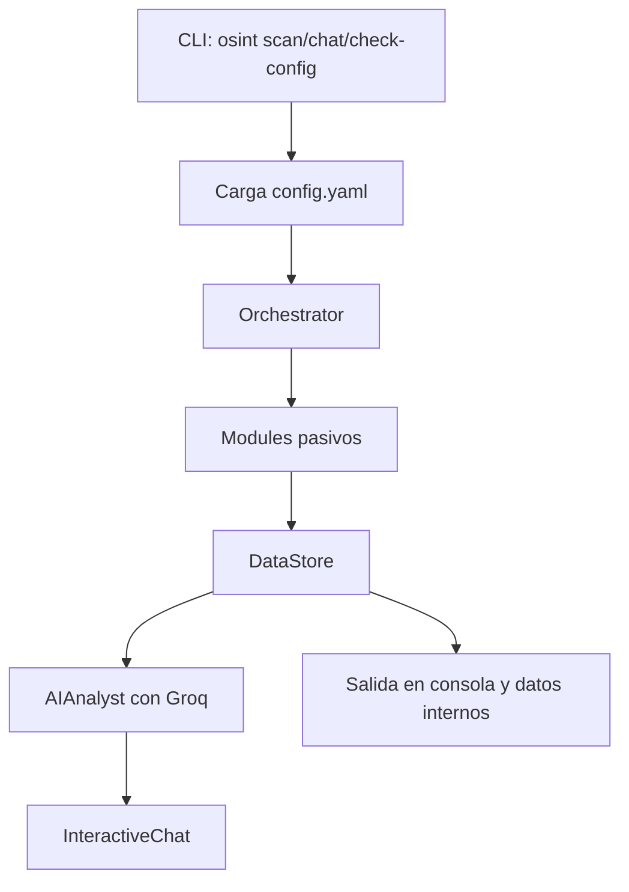

# osint-framework

Framework modular de reconocimiento OSINT escrito en Python. El proyecto automatiza la recopilación pasiva de información pública sobre un objetivo, consolida los hallazgos en un almacén común, los deduplica y, si hay configuración de IA, genera análisis de mayor nivel y un chat interactivo sobre los resultados.

El alcance es deliberadamente pasivo: consulta DNS, logs de transparencia de certificados, WHOIS, fuentes de exposición de infraestructura, filtraciones y presencia pública en repositorios y redes sociales. No explota vulnerabilidades ni interactúa con el objetivo de forma activa.

## Aviso de uso

Usa esta herramienta solo sobre objetivos propios o con autorización explícita. El proyecto está pensado para auditorías, investigación defensiva, laboratorios y ejercicios de aprendizaje.

## Qué hace

El flujo general es este:



El proyecto está organizado en capas:

1. **Capa de configuración**: lee el YAML, valida el esquema básico y expone las API keys.
2. **Capa de ejecución**: el orquestador registra módulos y los ejecuta en paralelo con `asyncio`.
3. **Capa de recolección**: cada módulo consulta una fuente pública concreta y produce `Finding`.
4. **Capa de consolidación**: `DataStore` normaliza, deduplica y resume los hallazgos.
5. **Capa de IA**: Groq genera resúmenes, correlaciones, dorks y score de riesgo.
6. **Capa interactiva**: el chat permite explorar los resultados en lenguaje natural.

## Qué problema resuelve

En OSINT real, el problema no suele ser encontrar una fuente aislada, sino combinar muchas señales pequeñas. Este proyecto intenta resolver precisamente eso:

- centraliza la recopilación en un único punto de entrada
- ejecuta módulos en paralelo para reducir tiempo de espera
- clasifica resultados por severidad
- elimina duplicados entre módulos
- añade una capa de análisis cruzado con IA
- ofrece una conversación interactiva sobre el escaneo ya realizado

## Dependencias

Las dependencias runtime declaradas en `pyproject.toml` son:

- `click`: interfaz de línea de comandos
- `rich`: salida con formato, paneles, progreso y markdown
- `structlog`: logs estructurados
- `pydantic`: modelos de configuración y validación
- `pyyaml`: lectura de `config.yaml`
- `aiohttp`: peticiones HTTP asíncronas y streaming SSE
- `aiodns`: consultas DNS asíncronas
- `dnspython`: utilidades DNS adicionales y AXFR
- `cryptography`: análisis de certificados X.509
- `python-whois`: WHOIS de dominios
- `ipwhois`: WHOIS de IPs y ASN
- `tweepy`: acceso a Twitter/X cuando hay token

Las dependencias de desarrollo son:

- `pytest`
- `pytest-asyncio`
- `pytest-cov`
- `ruff`
- `mypy`

Requisitos base:

- Python 3.11 o superior
- Poetry

## Estructura del proyecto

### Raíz del repositorio

| Archivo | Qué hace |
|---|---|
| `pyproject.toml` | Define dependencias, scripts de Poetry, versión de Python y configuración de Ruff. |
| `config.example.yaml` | Plantilla de configuración para crear `config.yaml`. |
| `config.yaml` | Configuración local real usada por el proyecto. |
| `README.md` | Documentación principal del proyecto. |
| `LICENSE` | Licencia del proyecto. |
| `probar_groq.py` | Script manual para comprobar el proveedor Groq y el streaming. |
| `probar_analyst.py` | Script manual para probar `AIAnalyst` con un `DataStore` de ejemplo. |
| `probar_chat.py` | Script manual para probar el chat interactivo con datos sintéticos. |

### Paquete `osint`

| Archivo | Qué hace |
|---|---|
| `osint/__init__.py` | Marcador de paquete. |
| `osint/cli.py` | Entrada principal del CLI con `scan`, `chat` y `check-config`. |

### `osint/core`

| Archivo | Qué hace |
|---|---|
| `osint/core/__init__.py` | Marcador de paquete. |
| `osint/core/config.py` | Modelos Pydantic para cargar y validar el YAML. |
| `osint/core/datastore.py` | Define `Finding`, `Severity` y `DataStore`. |
| `osint/core/orchestrator.py` | Define `BaseModule` y ejecuta los módulos en paralelo. |
| `osint/core/rate_limiter.py` | Utilidad de rate limiting y selección de user-agents. |

### `osint/modules`

| Archivo | Qué hace |
|---|---|
| `osint/modules/__init__.py` | Marcador de paquete. |
| `osint/modules/dns_module.py` | Enumeración DNS, AXFR y fuerza bruta opcional de subdominios. |
| `osint/modules/tls_module.py` | CT logs de `crt.sh` y análisis del certificado TLS activo. |
| `osint/modules/whois_module.py` | WHOIS de dominio e IP, ASN y proveedor de red. |
| `osint/modules/shodan_module.py` | Infraestructura expuesta, puertos, banners, CVEs y paneles. |
| `osint/modules/leaks_module.py` | Filtraciones de credenciales con HIBP o breach.directory. |
| `osint/modules/socials_module.py` | Reconocimiento de GitHub, Twitter/X y LinkedIn. |

### `osint/ai`

| Archivo | Qué hace |
|---|---|
| `osint/ai/__init__.py` | Marcador de paquete. |
| `osint/ai/providers.py` | Interfaz de proveedores de LLM y proveedor Groq. |
| `osint/ai/analyst.py` | Genera resúmenes, correlaciones, dorks y risk score. |
| `osint/ai/chat.py` | Chat interactivo post-scan con streaming y comandos especiales. |

### Tests

| Archivo | Qué hace |
|---|---|
| `tests/__init__.py` | Marcador de paquete. |
| `tests/test_dns_module.py` | Tests del módulo DNS. |
| `tests/test_tls_module.py` | Tests del módulo TLS. |
| `tests/test_whois_module.py` | Tests del módulo WHOIS. |
| `tests/test_shodan_module.py` | Tests del módulo Shodan. |
| `tests/test_leaks_module.py` | Tests del módulo de filtraciones. |
| `tests/test_socials_module.py` | Tests del módulo de redes sociales. |

## Módulos y fuentes de datos

### DNS

El módulo DNS usa `aiodns` y `dnspython` para:

- resolver registros `A`, `AAAA`, `MX`, `NS`, `TXT`, `CNAME` y `SOA`
- detectar política de correo en `TXT` cuando aparece SPF o DMARC
- intentar transferencia de zona `AXFR`
- buscar subdominios por fuerza bruta si se activa `modules.dns.bruteforce`

Los resultados suelen producir hallazgos informativos, pero una transferencia de zona exitosa se marca como alta severidad.

### TLS

El módulo TLS combina dos fuentes:

- `crt.sh` para Certificate Transparency Logs
- conexión TLS directa al host para analizar el certificado activo

Extrae subdominios, fechas de expiración, SANs, algoritmos débiles, claves RSA cortas y certificados autofirmados.

### WHOIS

El módulo WHOIS usa `python-whois` para dominios y `ipwhois` para IPs. Obtiene:

- registrar y fechas del dominio
- nameservers
- registrante cuando está disponible
- ASN, bloque CIDR y organización de la IP
- detección de proveedor cloud a partir de la descripción del ASN

### Shodan

El módulo Shodan está pensado para mapear infraestructura expuesta. Usa una secuencia de fuentes:

- Shodan, si hay API key
- Censys Host Lookup como complemento
- `ipinfo.io` y resolución DNS estándar como apoyo cuando falta información

Clasifica puertos, banners, paneles de administración, cabeceras de seguridad ausentes y CVEs detectados por banners.

### Filtraciones

El módulo de filtraciones consulta:

- HaveIBeenPwned cuando hay API key
- breach.directory como alternativa gratuita

Registra resumen de brechas, emails comprometidos y detalles de cada breach cuando están disponibles.

### Socials

El módulo de redes sociales trabaja con:

- GitHub API para organizaciones, usuarios y repositorios públicos
- Twitter/X vía API si existe token, o mediante dorks si no
- LinkedIn mediante dorks pasivos en Google

Busca perfiles públicos, confirma relación con el dominio, detecta repositorios sospechosos y expone tecnologías visibles públicamente.

## Capa de IA

La capa de IA está compuesta por tres piezas:

- `BaseProvider` define la interfaz común
- `GroqProvider` implementa la llamada real a la API de Groq
- `AIAnalyst` genera análisis de más alto nivel sobre el `DataStore`
- `InteractiveChat` permite conversar con el contexto del scan

### Qué genera `AIAnalyst`

- resumen ejecutivo
- correlaciones entre módulos
- Google dorks personalizados
- score de riesgo global

### Qué hace el chat

- mantiene historial de conversación
- inyecta el contexto del scan y los insights previos
- soporta streaming token a token
- ofrece comandos especiales como `/resumen`, `/correlaciones`, `/dorks` y `/riesgo`

## Data model

El proyecto gira alrededor de dos objetos:

```python
Finding(
    module="dns",
    type="subdomain",
    value="dev.ejemplo.com",
    severity="low",
    source="dns/bruteforce",
    metadata={"ips": ["1.2.3.4"]},
)
```

`DataStore` deduplica por la clave `module:type:value`, así que dos módulos que descubran el mismo dato no lo duplican en el resumen final. Además permite filtrar por módulo, severidad o tipo, y generar un resumen agregado.

## Cómo se ejecuta un scan

1. `cli.py` recibe el target y carga `config.yaml`.
2. `Orchestrator` construye y registra los módulos disponibles.
3. Cada módulo se ejecuta en paralelo con `asyncio.gather()`.
4. Los findings retornan al `DataStore`.
5. Si Groq está configurado, `AIAnalyst` añade insights de nivel superior.
6. Si no se desactiva, `InteractiveChat` abre una sesión sobre el resultado.

## Configuración

La plantilla base está en `config.example.yaml`. Los campos que el código usa hoy son estos:

```yaml
apis:
  groq: "API_KEY_GROQ"
  shodan: "API_KEY_SHODAN"
  hibp: "API_KEY_HIBP"
  github: "API_KEY_GITHUB"
  twitter: "API_KEY_TWITTER"
  censys_id: "API_KEY_CENSYS_ID"
  censys_secret: "API_KEY_CENSYS_SECRET"

network:
  timeout: 10
  retries: 3
  proxy: null

modules:
  dns:
    enabled: true
    bruteforce: false
    wordlist: null
    resolvers: ["8.8.8.8", "1.1.1.1"]

output:
  directory: "./reports"
  formats: ["json", "html"]
```

### Nota importante sobre la configuración de IA

El archivo de ejemplo incluye una sección `ai`, pero el modelo `Config` actual solo persiste `apis`, `network`, `modules` y `output`. En la versión actual eso significa que la sección `ai` del YAML no forma parte del objeto validado por `Config` salvo que se amplíe el modelo. El proveedor Groq sigue funcionando porque el código cae en valores por defecto y lee la API key de `apis.groq`.

## Uso

Instalación y primer arranque:

```bash
git clone https://github.com/0xAudit-Path/osint-framework.git
cd osint-framework
poetry install
cp config.example.yaml config.yaml
```

Comandos principales:

```bash
poetry run osint scan ejemplo.com
poetry run osint scan ejemplo.com -m dns -m tls -m whois
poetry run osint scan ejemplo.com -f json -f html -f csv
poetry run osint scan ejemplo.com -o ./mis-informes
poetry run osint chat ejemplo.com
poetry run osint check-config
```

### Qué hace cada comando

- `scan`: ejecuta el reconocimiento sobre un dominio o IP
- `chat`: abre un chat interactivo sobre un objetivo, usando un `DataStore` vacío si no se pasó un scan previo
- `check-config`: muestra qué API keys están configuradas y qué módulos quedan disponibles

## Tests

Ejecutar la suite completa:

```bash
poetry run pytest tests -v
```

Ejecutar un módulo concreto:

```bash
poetry run pytest tests/test_dns_module.py -v
```

Con cobertura:

```bash
poetry run pytest tests --cov=osint --cov-report=term-missing
```

## Estado actual del árbol

Hay algunas piezas que conviene conocer para no confundir documentación histórica con el código real:

- no existe un subpaquete `reports/` en el árbol actual
- no existe un comando `ai-setup` en el CLI actual
- `rate_limiter.py` está presente como utilidad, pero no está conectado al flujo principal del escaneo
- `Groq` es el único proveedor de IA realmente implementado en `providers.py`
- el chat interactivo y el analista de IA sí están integrados en el código actual

## Cómo leer este proyecto como IA

Si estás usando este README como contexto para otra IA, la lectura más útil suele ser esta:

1. `osint/core/datastore.py` para entender el modelo de datos.
2. `osint/core/orchestrator.py` para entender cómo se ejecutan y agregan módulos.
3. Un módulo concreto de `osint/modules/` para ver el patrón de extracción y severidad.
4. `osint/ai/analyst.py` y `osint/ai/chat.py` para ver cómo se construye el contexto de IA.
5. `osint/cli.py` para entender la entrada real del programa.

## Resumen corto

Este proyecto es un framework OSINT pasivo, modular y asíncrono. Su valor está en combinar fuentes públicas heterogéneas, normalizarlas en un único `DataStore` y, opcionalmente, convertir esos datos en una lectura de seguridad más útil con Groq y el chat interactivo.

Framework modular de reconocimiento OSINT escrito en Python. El proyecto automatiza la recopilación pasiva de información pública sobre un objetivo, consolida los hallazgos en un almacén común, los deduplica y, si hay configuración de IA, genera análisis de mayor nivel y un chat interactivo sobre los resultados.

El alcance es deliberadamente pasivo: consulta DNS, logs de transparencia de certificados, WHOIS, fuentes de exposición de infraestructura, filtraciones y presencia pública en repositorios y redes sociales. No explota vulnerabilidades ni interactúa con el objetivo de forma activa.

## Aviso de uso

Usa esta herramienta solo sobre objetivos propios o con autorización explícita. El proyecto está pensado para auditorías, investigación defensiva, laboratorios y ejercicios de aprendizaje.

## Qué hace

El flujo general es este:


El proyecto está organizado en capas:

1. **Capa de configuración**: lee el YAML, valida el esquema básico y expone las API keys.
2. **Capa de ejecución**: el orquestador registra módulos y los ejecuta en paralelo con `asyncio`.
3. **Capa de recolección**: cada módulo consulta una fuente pública concreta y produce `Finding`.
4. **Capa de consolidación**: `DataStore` normaliza, deduplica y resume los hallazgos.
5. **Capa de IA**: Groq genera resúmenes, correlaciones, dorks y score de riesgo.
6. **Capa interactiva**: el chat permite explorar los resultados en lenguaje natural.

## Qué problema resuelve

En OSINT real, el problema no suele ser encontrar una fuente aislada, sino combinar muchas señales pequeñas. Este proyecto intenta resolver precisamente eso:

- centraliza la recopilación en un único punto de entrada
- ejecuta módulos en paralelo para reducir tiempo de espera
- clasifica resultados por severidad
- elimina duplicados entre módulos
- añade una capa de análisis cruzado con IA
- ofrece una conversación interactiva sobre el escaneo ya realizado

## Dependencias

Las dependencias runtime declaradas en `pyproject.toml` son:

- `click`: interfaz de línea de comandos
- `rich`: salida con formato, paneles, progreso y markdown
- `structlog`: logs estructurados
- `pydantic`: modelos de configuración y validación
- `pyyaml`: lectura de `config.yaml`
- `aiohttp`: peticiones HTTP asíncronas y streaming SSE
- `aiodns`: consultas DNS asíncronas
- `dnspython`: utilidades DNS adicionales y AXFR
- `cryptography`: análisis de certificados X.509
- `python-whois`: WHOIS de dominios
- `ipwhois`: WHOIS de IPs y ASN
- `tweepy`: acceso a Twitter/X cuando hay token

Las dependencias de desarrollo son:

- `pytest`
- `pytest-asyncio`
- `pytest-cov`
- `ruff`
- `mypy`

Requisitos base:

- Python 3.11 o superior
- Poetry

## Estructura del proyecto

### Raíz del repositorio

| Archivo | Qué hace |
|---|---|
| `pyproject.toml` | Define dependencias, scripts de Poetry, versión de Python y configuración de Ruff. |
| `config.example.yaml` | Plantilla de configuración para crear `config.yaml`. |
| `config.yaml` | Configuración local real usada por el proyecto. |
| `README.md` | Documentación principal del proyecto. |
| `LICENSE` | Licencia del proyecto. |
| `probar_groq.py` | Script manual para comprobar el proveedor Groq y el streaming. |
| `probar_analyst.py` | Script manual para probar `AIAnalyst` con un `DataStore` de ejemplo. |
| `probar_chat.py` | Script manual para probar el chat interactivo con datos sintéticos. |

### Paquete `osint`

| Archivo | Qué hace |
|---|---|
| `osint/__init__.py` | Marcador de paquete. |
| `osint/cli.py` | Entrada principal del CLI con `scan`, `chat` y `check-config`. |

### `osint/core`

| Archivo | Qué hace |
|---|---|
| `osint/core/__init__.py` | Marcador de paquete. |
| `osint/core/config.py` | Modelos Pydantic para cargar y validar el YAML. |
| `osint/core/datastore.py` | Define `Finding`, `Severity` y `DataStore`. |
| `osint/core/orchestrator.py` | Define `BaseModule` y ejecuta los módulos en paralelo. |
| `osint/core/rate_limiter.py` | Utilidad de rate limiting y selección de user-agents. |

### `osint/modules`

| Archivo | Qué hace |
|---|---|
| `osint/modules/__init__.py` | Marcador de paquete. |
| `osint/modules/dns_module.py` | Enumeración DNS, AXFR y fuerza bruta opcional de subdominios. |
| `osint/modules/tls_module.py` | CT logs de `crt.sh` y análisis del certificado TLS activo. |
| `osint/modules/whois_module.py` | WHOIS de dominio e IP, ASN y proveedor de red. |
| `osint/modules/shodan_module.py` | Infraestructura expuesta, puertos, banners, CVEs y paneles. |
| `osint/modules/leaks_module.py` | Filtraciones de credenciales con HIBP o breach.directory. |
| `osint/modules/socials_module.py` | Reconocimiento de GitHub, Twitter/X y LinkedIn. |

### `osint/ai`

| Archivo | Qué hace |
|---|---|
| `osint/ai/__init__.py` | Marcador de paquete. |
| `osint/ai/providers.py` | Interfaz de proveedores de LLM y proveedor Groq. |
| `osint/ai/analyst.py` | Genera resúmenes, correlaciones, dorks y risk score. |
| `osint/ai/chat.py` | Chat interactivo post-scan con streaming y comandos especiales. |

### Tests

| Archivo | Qué hace |
|---|---|
| `tests/__init__.py` | Marcador de paquete. |
| `tests/test_dns_module.py` | Tests del módulo DNS. |
| `tests/test_tls_module.py` | Tests del módulo TLS. |
| `tests/test_whois_module.py` | Tests del módulo WHOIS. |
| `tests/test_shodan_module.py` | Tests del módulo Shodan. |
| `tests/test_leaks_module.py` | Tests del módulo de filtraciones. |
| `tests/test_socials_module.py` | Tests del módulo de redes sociales. |

## Módulos y fuentes de datos

### DNS

El módulo DNS usa `aiodns` y `dnspython` para:

- resolver registros `A`, `AAAA`, `MX`, `NS`, `TXT`, `CNAME` y `SOA`
- detectar política de correo en `TXT` cuando aparece SPF o DMARC
- intentar transferencia de zona `AXFR`
- buscar subdominios por fuerza bruta si se activa `modules.dns.bruteforce`

Los resultados suelen producir hallazgos informativos, pero una transferencia de zona exitosa se marca como alta severidad.

### TLS

El módulo TLS combina dos fuentes:

- `crt.sh` para Certificate Transparency Logs
- conexión TLS directa al host para analizar el certificado activo

Extrae subdominios, fechas de expiración, SANs, algoritmos débiles, claves RSA cortas y certificados autofirmados.

### WHOIS

El módulo WHOIS usa `python-whois` para dominios y `ipwhois` para IPs. Obtiene:

- registrar y fechas del dominio
- nameservers
- registrante cuando está disponible
- ASN, bloque CIDR y organización de la IP
- detección de proveedor cloud a partir de la descripción del ASN

### Shodan

El módulo Shodan está pensado para mapear infraestructura expuesta. Usa una secuencia de fuentes:

- Shodan, si hay API key
- Censys Host Lookup como complemento
- `ipinfo.io` y resolución DNS estándar como apoyo cuando falta información

Clasifica puertos, banners, paneles de administración, cabeceras de seguridad ausentes y CVEs detectados por banners.

### Filtraciones

El módulo de filtraciones consulta:

- HaveIBeenPwned cuando hay API key
- breach.directory como alternativa gratuita

Registra resumen de brechas, emails comprometidos y detalles de cada breach cuando están disponibles.

### Socials

El módulo de redes sociales trabaja con:

- GitHub API para organizaciones, usuarios y repositorios públicos
- Twitter/X vía API si existe token, o mediante dorks si no
- LinkedIn mediante dorks pasivos en Google

Busca perfiles públicos, confirma relación con el dominio, detecta repositorios sospechosos y expone tecnologías visibles públicamente.

## Capa de IA

La capa de IA está compuesta por tres piezas:

- `BaseProvider` define la interfaz común
- `GroqProvider` implementa la llamada real a la API de Groq
- `AIAnalyst` genera análisis de más alto nivel sobre el `DataStore`
- `InteractiveChat` permite conversar con el contexto del scan

### Qué genera `AIAnalyst`

- resumen ejecutivo
- correlaciones entre módulos
- Google dorks personalizados
- score de riesgo global

### Qué hace el chat

- mantiene historial de conversación
- inyecta el contexto del scan y los insights previos
- soporta streaming token a token
- ofrece comandos especiales como `/resumen`, `/correlaciones`, `/dorks` y `/riesgo`

## Data model

El proyecto gira alrededor de dos objetos:

```python
Finding(
    module="dns",
    type="subdomain",
    value="dev.ejemplo.com",
    severity="low",
    source="dns/bruteforce",
    metadata={"ips": ["1.2.3.4"]},
)
```

`DataStore` deduplica por la clave `module:type:value`, así que dos módulos que descubran el mismo dato no lo duplican en el resumen final. Además permite filtrar por módulo, severidad o tipo, y generar un resumen agregado.

## Cómo se ejecuta un scan

1. `cli.py` recibe el target y carga `config.yaml`.
2. `Orchestrator` construye y registra los módulos disponibles.
3. Cada módulo se ejecuta en paralelo con `asyncio.gather()`.
4. Los findings retornan al `DataStore`.
5. Si Groq está configurado, `AIAnalyst` añade insights de nivel superior.
6. Si no se desactiva, `InteractiveChat` abre una sesión sobre el resultado.

## Configuración

La plantilla base está en `config.example.yaml`. Los campos que el código usa hoy son estos:

```yaml
apis:
  groq: "API_KEY_GROQ"
  shodan: "API_KEY_SHODAN"
  hibp: "API_KEY_HIBP"
  github: "API_KEY_GITHUB"
  twitter: "API_KEY_TWITTER"
  censys_id: "API_KEY_CENSYS_ID"
  censys_secret: "API_KEY_CENSYS_SECRET"

network:
  timeout: 10
  retries: 3
  proxy: null

modules:
  dns:
    enabled: true
    bruteforce: false
    wordlist: null
    resolvers: ["8.8.8.8", "1.1.1.1"]

output:
  directory: "./reports"
  formats: ["json", "html"]
```

### Nota importante sobre la configuración de IA

El archivo de ejemplo incluye una sección `ai`, pero el modelo `Config` actual solo persiste `apis`, `network`, `modules` y `output`. En la versión actual eso significa que la sección `ai` del YAML no forma parte del objeto validado por `Config` salvo que se amplíe el modelo. El proveedor Groq sigue funcionando porque el código cae en valores por defecto y lee la API key de `apis.groq`.

## Uso

Instalación y primer arranque:

```bash
git clone https://github.com/0xAudit-Path/osint-framework.git
cd osint-framework
poetry install
cp config.example.yaml config.yaml
```

Comandos principales:

```bash
poetry run osint scan ejemplo.com
poetry run osint scan ejemplo.com -m dns -m tls -m whois
poetry run osint scan ejemplo.com -f json -f html -f csv
poetry run osint scan ejemplo.com -o ./mis-informes
poetry run osint chat ejemplo.com
poetry run osint check-config
```

### Qué hace cada comando

- `scan`: ejecuta el reconocimiento sobre un dominio o IP
- `chat`: abre un chat interactivo sobre un objetivo, usando un `DataStore` vacío si no se pasó un scan previo
- `check-config`: muestra qué API keys están configuradas y qué módulos quedan disponibles

## Tests

Ejecutar la suite completa:

```bash
poetry run pytest tests -v
```

Ejecutar un módulo concreto:

```bash
poetry run pytest tests/test_dns_module.py -v
```

Con cobertura:

```bash
poetry run pytest tests --cov=osint --cov-report=term-missing
```

## Estado actual del árbol

Hay algunas piezas que conviene conocer para no confundir documentación histórica con el código real:

- no existe un subpaquete `reports/` en el árbol actual
- no existe un comando `ai-setup` en el CLI actual
- `rate_limiter.py` está presente como utilidad, pero no está conectado al flujo principal del escaneo
- `Groq` es el único proveedor de IA realmente implementado en `providers.py`
- el chat interactivo y el analista de IA sí están integrados en el código actual

## Cómo leer este proyecto como IA

Si estás usando este README como contexto para otra IA, la lectura más útil suele ser esta:

1. `osint/core/datastore.py` para entender el modelo de datos.
2. `osint/core/orchestrator.py` para entender cómo se ejecutan y agregan módulos.
3. Un módulo concreto de `osint/modules/` para ver el patrón de extracción y severidad.
4. `osint/ai/analyst.py` y `osint/ai/chat.py` para ver cómo se construye el contexto de IA.
5. `osint/cli.py` para entender la entrada real del programa.

## Resumen corto

Este proyecto es un framework OSINT pasivo, modular y asíncrono. Su valor está en combinar fuentes públicas heterogéneas, normalizarlas en un único `DataStore` y, opcionalmente, convertir esos datos en una lectura de seguridad más útil con Groq y el chat interactivo.

