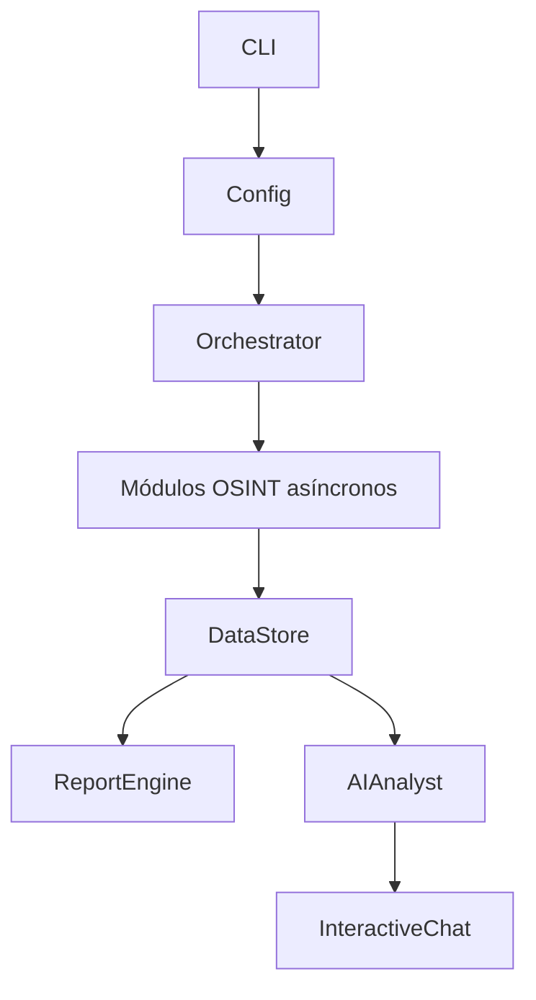

# osint-framework

Framework modular de reconocimiento OSINT pasivo escrito en Python. Consulta fuentes públicas sobre un dominio o una IP, consolida los resultados en un `DataStore`, elimina duplicados y genera informes en varios formatos.

El proyecto está pensado para auditorías autorizadas, investigación defensiva, laboratorios y aprendizaje. No explota vulnerabilidades ni debe utilizarse contra objetivos sin autorización explícita.

## Características

- Ejecución asíncrona de módulos con `asyncio`.
- Resolución y enumeración DNS, incluidos registros comunes y AXFR.
- Certificate Transparency y análisis del certificado TLS activo.
- WHOIS de dominios e IPs, ASN y proveedor de red.
- Información de infraestructura expuesta mediante Shodan, Censys e ipinfo.
- Comprobación de filtraciones con HIBP o `breach.directory`.
- Reconocimiento público de GitHub, Twitter/X y LinkedIn.
- Clasificación de hallazgos por severidad y deduplicación centralizada.
- Informes JSON, HTML y CSV. La opción PDF genera un HTML preparado para imprimir o convertir a PDF.
- Análisis opcional con Groq u Ollama y chat interactivo sobre un informe JSON.

## Requisitos

- Python 3.11 o superior.
- [Poetry](https://python-poetry.org/).
- API keys solo para las fuentes que quieras habilitar; varios módulos tienen alternativas gratuitas o funcionan sin credenciales.

## Instalación

```bash
git clone https://github.com/0xAudit-Path/osint-framework.git
cd osint-framework
poetry install
cp config.example.yaml config.yaml
```

Edita `config.yaml` y sustituye los placeholders por tus credenciales. Este archivo contiene secretos y está excluido de Git; no compartas sus valores.

También se puede construir la imagen Docker:

```bash
docker build -t osint-framework .
docker run --rm -v "$PWD/config.yaml:/app/config.yaml:ro" \
  -v "$PWD/reports:/app/reports" \
  osint-framework scan ejemplo.com --no-chat
```

## Dependencias

Las dependencias runtime declaradas en `pyproject.toml` son:

- `click`: interfaz CLI.
- `rich`: consola, progreso y salida formateada.
- `structlog`: logging estructurado.
- `pydantic` y `pyyaml`: validación y carga de configuración.
- `aiohttp`: peticiones HTTP asíncronas y streaming SSE.
- `aiodns` y `dnspython`: resolución DNS y AXFR.
- `cryptography`: análisis de certificados X.509.
- `python-whois` e `ipwhois`: WHOIS de dominios, IPs y ASN.
- `tweepy`: acceso opcional a Twitter/X.

Dependencias de desarrollo:

- `pytest`, `pytest-asyncio` y `pytest-cov` para pruebas y cobertura.
- `ruff` para lint y formato compatible con la configuración del proyecto.
- `mypy` para comprobación estática en Python 3.11.

## Configuración

La plantilla completa está en [`config.example.yaml`](config.example.yaml). La configuración se valida con modelos Pydantic y admite estas secciones:

```yaml
apis:
  groq: "API_KEY_GROQ"
  shodan: "API_KEY_SHODAN"
  hibp: "API_KEY_HIBP"
  github: "API_KEY_GITHUB"
  twitter: "API_KEY_TWITTER"
  censys_id: "API_KEY_CENSYS_ID"
  censys_secret: "API_KEY_CENSYS_SECRET"

network:
  timeout: 10
  retries: 3
  proxy: null

modules:
  dns:
    enabled: true
    bruteforce: false
    wordlist: null
    resolvers: ["8.8.8.8", "1.1.1.1"]

output:
  directory: "./reports"
  formats: ["json", "html", "csv"]

ai:
  enabled: true
  provider: "groq"
  model: "llama-3.3-70b-versatile"
```

### Credenciales y fallbacks

- `groq` activa el análisis y el chat con Groq. También se puede usar `provider: "ollama"` para un modelo local en `http://localhost:11434/api`; Ollama no necesita API key.
- `shodan` habilita el enriquecimiento de Shodan. Sin ella, el módulo puede apoyarse en Censys, ipinfo y la resolución DNS.
- `hibp` es opcional; sin ella se usa `breach.directory`.
- `twitter` es opcional; sin token se generan búsquedas pasivas.
- `github`, `censys_id` y `censys_secret` habilitan sus integraciones cuando están configuradas.

Las opciones `enabled`, `provider` y `model` de `ai` se aplican directamente. La sección `features` que aparece como referencia en el archivo de ejemplo se conserva para configuración futura, pero el flujo actual controla el análisis con `ai.enabled` y la opción `--no-ai`.

## Uso

Todos los comandos se pueden ejecutar con Poetry:

```bash
# Escaneo completo con los módulos habilitados
poetry run osint scan ejemplo.com

# Ejecutar solo módulos concretos
poetry run osint scan ejemplo.com -m dns -m tls -m whois

# Elegir formatos y directorio de salida
poetry run osint scan ejemplo.com -f json -f html -f csv -o ./mis-informes

# Omitir IA o chat en un escaneo
poetry run osint scan ejemplo.com --no-ai --no-chat

# Validar la configuración
poetry run osint check-config
poetry run osint check-config --config ./otra-config.yaml

# Abrir el chat usando automáticamente reports/ejemplo.com_report.json
poetry run osint chat ejemplo.com

# Cargar un informe JSON concreto como contexto
poetry run osint chat ejemplo.com -r ./reports/ejemplo.com_report.json
```

El argumento `TARGET` puede ser un dominio o una dirección IP. Los módulos disponibles son `dns`, `tls`, `whois`, `shodan`, `leaks` y `socials`.

La opción `--format pdf` está disponible en el CLI, pero no incorpora un motor PDF: genera el mismo HTML imprimible que la opción `html`.

## Informes

`ReportEngine` escribe los informes en el directorio configurado, por defecto `./reports`, usando el nombre `<target>_report`:

- `.json`: resumen, hallazgos e insights de IA serializados.
- `.html`: informe navegable e imprimible.
- `.csv`: hallazgos tabulares.

El comando `chat` puede reconstruir un `DataStore` desde el JSON generado y cargar también los insights guardados en ese informe.

## Arquitectura



### Estructura principal

| Ruta | Responsabilidad |
|---|---|
| `osint/cli.py` | Comandos `scan`, `chat` y `check-config`. |
| `osint/core/config.py` | Modelos Pydantic y carga de YAML. |
| `osint/core/datastore.py` | `Finding`, `Severity` y almacenamiento deduplicado. |
| `osint/core/orchestrator.py` | Registro y ejecución paralela de módulos. |
| `osint/core/rate_limiter.py` | Utilidades de rate limiting y user-agents. |
| `osint/modules/` | Módulos DNS, TLS, WHOIS, Shodan, leaks y socials. |
| `osint/ai/providers.py` | Proveedores Groq y Ollama con streaming. |
| `osint/ai/analyst.py` | Resumen, correlaciones, dorks y riesgo. |
| `osint/ai/chat.py` | Chat interactivo sobre los resultados. |
| `osint/reports/engine.py` | Coordinación de exportadores. |
| `osint/reports/exporters/` | Exportadores JSON, HTML y CSV. |
| `tests/` | Pruebas unitarias de los módulos de recolección. |

`DataStore` deduplica por `module:type:value` y ofrece filtros por módulo, severidad y tipo. También calcula un score estático de riesgo de 0 a 100 a partir de la severidad de los hallazgos.

## Desarrollo y pruebas

```bash
# Suite completa
poetry run pytest tests -v

# Un módulo concreto
poetry run pytest tests/test_shodan_module.py -v

# Cobertura
poetry run pytest tests --cov=osint --cov-report=term-missing

# Lint y comprobación de tipos
poetry run ruff check .
poetry run mypy osint
```

## Licencia

El proyecto se distribuye bajo la licencia MIT. Consulta [`LICENSE`](LICENSE).
